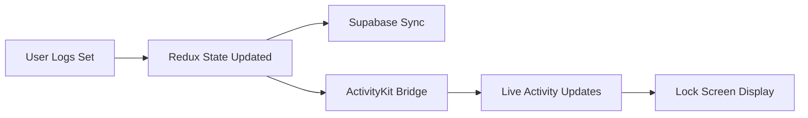

# Live Activities Implementation Plan

## Overview

LockdIn will use **Live Activities (ActivityKit)** instead of traditional widgets for real-time workout tracking and accountability.

## Why Live Activities?

Live Activities are perfect for LockdIn because they:
- Show real-time updates without opening the app
- Display on Lock Screen and Dynamic Island
- Perfect for ongoing activities (workouts, rest timers)
- More engaging than static widgets
- Update instantly when workout state changes

## What We'll Display

### During Active Workout
**Lock Screen:**
- Current exercise name
- Sets completed / Total sets
- Rest timer countdown (when active)
- Time elapsed in workout

**Dynamic Island (iPhone 14 Pro+):**
- Compact: Exercise name + timer
- Expanded: Full workout progress + controls

### Daily Progress (When No Active Workout)
**Lock Screen:**
- Today's completion percentage
- Streak flame with current count
- Categories completed today (✓/✗)
- Next scheduled workout

## Technical Implementation

### iOS (Swift + ActivityKit)

**Requirements:**
- iOS 16.1+
- ActivityKit framework
- App Groups for data sharing

**Files to Create:**
```
ios/
├── LockdInWidget/
│   ├── LockdInWidgetBundle.swift
│   ├── WorkoutActivityAttributes.swift
│   ├── WorkoutLiveActivity.swift
│   └── Info.plist
└── LockdIn/
    └── WorkoutActivityManager.swift
```

**Activity Attributes:**
```swift
struct WorkoutActivityAttributes: ActivityAttributes {
    public struct ContentState: Codable, Hashable {
        var exerciseName: String
        var currentSet: Int
        var totalSets: Int
        var isResting: Bool
        var restTimeRemaining: Int
        var workoutStartTime: Date
    }
    
    var workoutName: String
    var planName: String
}
```

**Use Cases:**

1. **Start Live Activity** (when workout begins)
2. **Update Activity** (each set completion)
3. **Show Rest Timer** (between sets)
4. **End Activity** (workout complete)

### Android (Kotlin + Jetpack Glance)

**Note:** Android doesn't have Live Activities, so we'll use:
- Ongoing Notification with custom layout
- Lock screen notification
- Real-time updates via foreground service

**Files to Create:**
```
android/app/src/main/java/
├── services/
│   └── WorkoutForegroundService.kt
├── notifications/
│   ├── WorkoutNotificationBuilder.kt
│   └── WorkoutNotificationManager.kt
└── receivers/
    └── WorkoutActionReceiver.kt
```

## React Native Bridge

### WorkoutActivityBridge

**Methods:**
```typescript
// Start Live Activity when workout begins
startWorkoutActivity(workoutName: string, exerciseName: string): Promise<string>

// Update during workout
updateWorkoutActivity(activityId: string, state: ActivityState): Promise<void>

// Start rest timer
startRestTimer(activityId: string, seconds: number): Promise<void>

// End activity
endWorkoutActivity(activityId: string): Promise<void>

// Show daily progress (when no active workout)
showDailyProgress(data: DailyProgressData): Promise<void>
```

### Integration Points

**Workout Session:**
- Start activity when user begins workout
- Update on each set completion
- Show rest timer between sets
- End when workout finishes

**Dashboard:**
- Show daily progress activity
- Update when any category is logged
- Display streak information
- Refresh on app foreground

## Data Flow



## Implementation Phases

### Phase 1: iOS Live Activities
1. Set up ActivityKit in Xcode
2. Create Activity Attributes
3. Build Live Activity UI
4. Create React Native bridge
5. Integrate with workout session

### Phase 2: Android Equivalent
1. Create foreground service
2. Build custom notification layout
3. Implement action handlers
4. Create React Native bridge
5. Integrate with workout session

### Phase 3: Daily Progress Display
1. Create progress activity attributes
2. Build progress UI (both platforms)
3. Update when categories are logged
4. Refresh streak data

## Key Features

### Real-Time Updates
- ✅ Exercise progress updates instantly
- ✅ Rest timer shows live countdown
- ✅ Set completion updates immediately
- ✅ Workout duration tracks in real-time

### Interactive Actions (iOS)
- Skip rest timer button
- Mark set as complete
- End workout early
- Quick log shortcut

### Persistent Display
- Stays on lock screen during workout
- Survives app backgrounding
- Clears when workout ends
- Falls back to daily progress when inactive

## Privacy & Battery

### Battery Optimization
- Updates only when state changes
- No continuous polling
- Efficient data transfer
- Automatic cleanup when stale

### Privacy
- User controls when activity starts
- No background tracking without active workout
- Clear end state
- Data stays local (syncs through app)

## Testing Considerations

1. **Workout Flow**
   - Start workout → Activity appears
   - Complete sets → Updates shown
   - Rest timer → Countdown visible
   - Finish workout → Activity dismisses

2. **Edge Cases**
   - App crash during workout
   - Phone lock/unlock
   - Activity timeout (8 hours)
   - Multiple devices (same account)

3. **Platform Differences**
   - iOS: Dynamic Island variants
   - Android: Notification variants
   - Tablet layouts
   - Accessibility support

## Success Metrics

- ✅ Activity starts within 500ms of workout begin
- ✅ Updates reflect within 1 second
- ✅ Rest timer accurate to the second
- ✅ Zero crashes related to activities
- ✅ Activity cleans up properly on completion

## Resources

- [Apple ActivityKit Documentation](https://developer.apple.com/documentation/activitykit)
- [Live Activities Design Guidelines](https://developer.apple.com/design/human-interface-guidelines/live-activities)
- [React Native Live Activities Library](https://github.com/margelo/react-native-live-activities)

## Dependencies

**iOS:**
```
pod 'ActivityKit'
```

**React Native:**
```bash
npm install react-native-live-activities
```

**Android:**
```gradle
implementation 'androidx.work:work-runtime-ktx:2.8.1'
```

## Migration from Original Widget Plan

**Changes:**
- ❌ Static widget that refreshes periodically
- ❌ Home screen widget placement
- ✅ Live Activities on lock screen
- ✅ Dynamic Island integration
- ✅ Real-time updates during workouts
- ✅ Falls back to daily progress when inactive

**Benefits:**
- More engaging user experience
- Better fits workout use case
- Real-time feedback during exercise
- Less battery drain than frequent widget updates
- Native iOS 16+ feature
